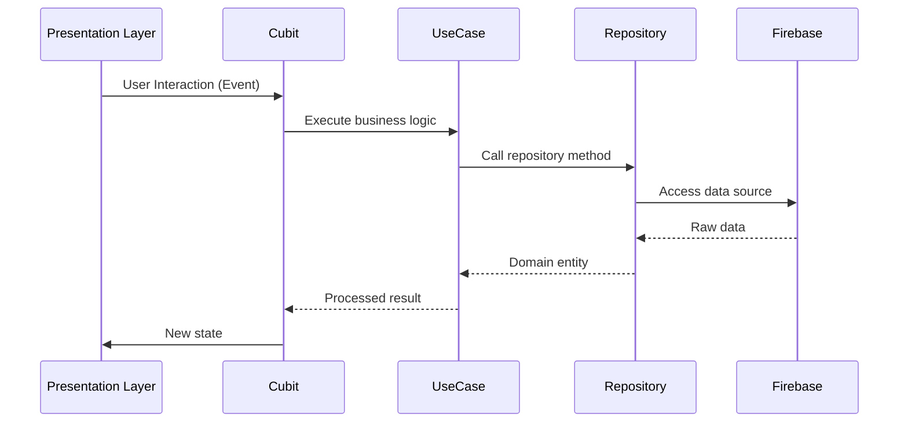

# GodSufficient

## Architecture & Tech Stack

### Clean Architecture Layers

#### Data Layer
- **Responsibilities**: Data sourcing, model definitions, repository implementations
- **Key Components**:
  - Firebase Auth integration (`fb_auth_datasource.dart`)
  - Model classes (`AppUserModel`)
  - Repository implementations (`AuthRepositoryImpl`)

#### Domain Layer
- **Responsibilities**: Business logic, entity definitions, abstract contracts
- **Key Components**:
  - Use cases (`SignIn`, `Register`)
  - Repository interfaces (`AuthRepo`)
  - Entity definitions (`AppUser`)

#### Presentation Layer
- **Responsibilities**: UI rendering, state management, navigation
- **Key Components**:
  - BLoC/Cubit state management (`AuthCubit`)
  - GoRouter configuration (`app_router.dart`)
  - Reusable widget components

### Directory Structure
```plaintext
lib/
├── features/
│   └── auth/
│       ├── data/
│       │   ├── datasources/    # Firebase implementations
│       │   ├── models/         # Data models
│       │   └── repositories/   # Concrete repos
│       ├── domain/
│       │   ├── entities/       # Business objects
│       │   ├── repositories/   # Abstract interfaces
│       │   └── usecases/       # Business logic
│       └── presentation/
│           ├── cubit/          # State management
│           ├── widgets/        # Shared components
│           └── screens/        # UI pages
├── common/                     # Shared resources
└── theme/                      # Design system
```

### Tech Stack

| Category           | Technologies/Packages       | Version   |
|--------------------|-----------------------------|-----------|
| Core Framework     | Flutter                     | 3.x       |
| Language           | Dart                        | 3.8.1     |
| State Management   | flutter_bloc + Cubit        | ^9.1.1    |
| Dependency Injection | get_it                    | ^8.0.3    |
| Firebase Services  | firebase_core + firebase_auth | ^3.15.1 / ^5.6.2 |
| Navigation         | go_router                   | ^16.0.0   |
| Validation         | validateit                  | Git       |

### State Management Flow


This architecture ensures separation of concerns, testability, and maintainability while leveraging Firebase for backend services and BLoC/Cubit for predictable state management.
